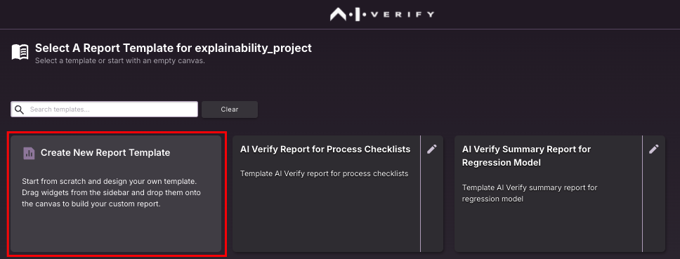
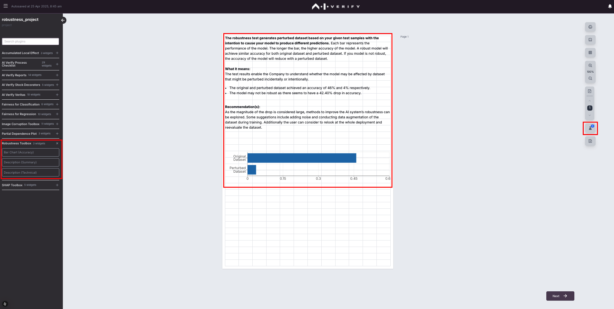
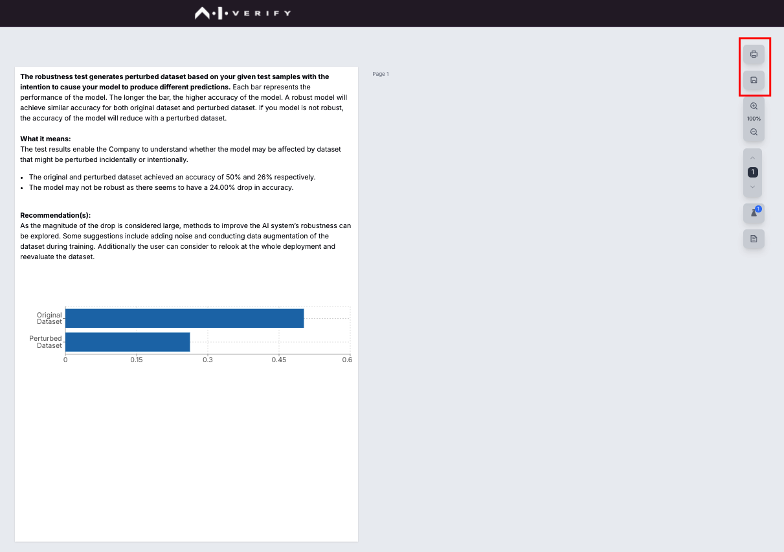

# Robustness Tests 

[Robustness Toobox](https://pypi.org/project/aiverify-robustness-toolbox/) generated a perturbed dataset using boundary attack algorithm on the test dataset. To execute this test against your model, you will need to [upload data and upload model](../getting-started.md) onto the portal. 

## Run using Command Line (CLI) interface

Install the test using pip:

```
pip install aiverify-robustiness-toolbox
```

Run the bash script to execute the plugin:

```
#!/bin/bash

root_path="<PATH_TO_FOLDER>/aiverify/stock-plugins/user_defined_files"
python -m aiverify_robustness_toolbox \
  --data_path $root_path/data/sample_bc_credit_data.sav \
  --model_path $root_path/model/sample_bc_credit_sklearn_linear.LogisticRegression.sav \
  --ground_truth_path $root_path/data/sample_bc_credit_data.sav\
  --ground_truth default \
  --model_type CLASSIFICATION
```

Once the algorithm runs successfully, the results will be saved in an `output` folder.
Use the generated result to create a report.


## Generate report

To generate report using the test results, select

HomePage > Create New Project  > Create New Report Template.




Select "Robustness Toolbox" on the left pane and pick the 3 widgets and load them onto the canvas and click "Next".




Choose the model and test results from previous run and click "Next".





Save the report or export as PDF.