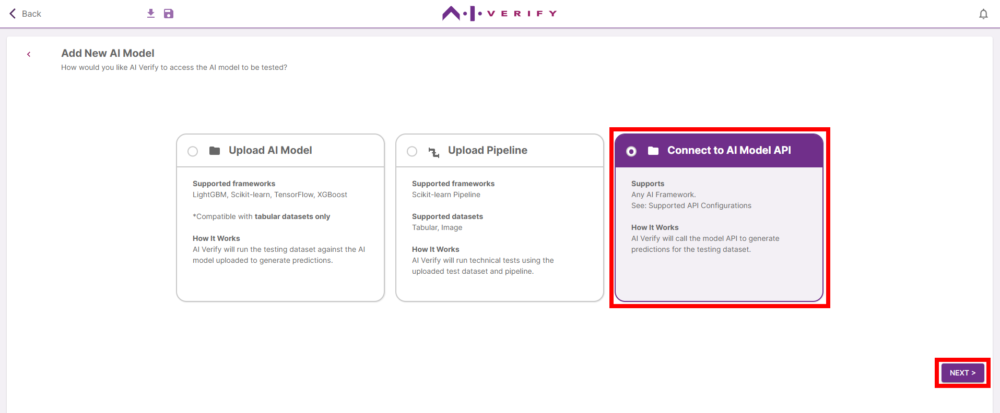
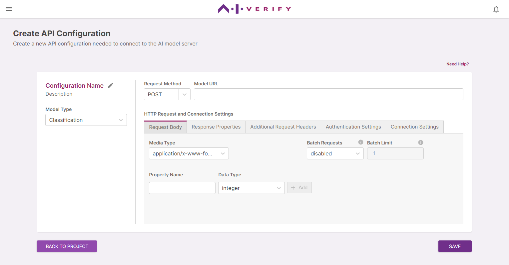
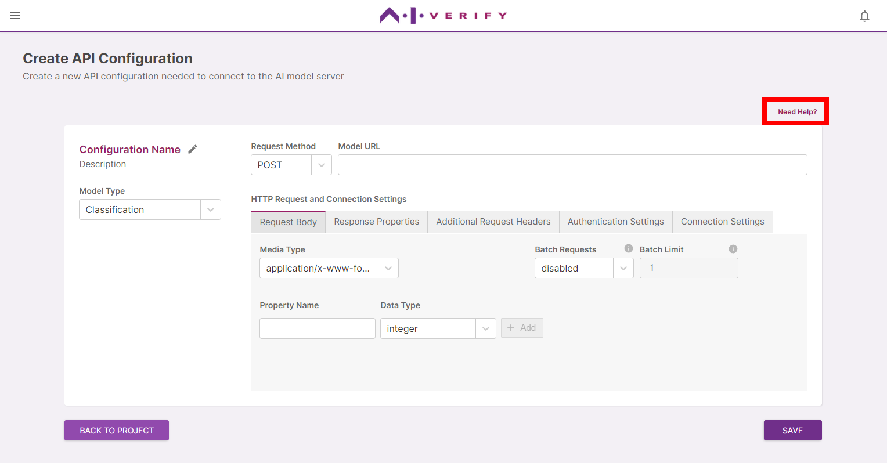
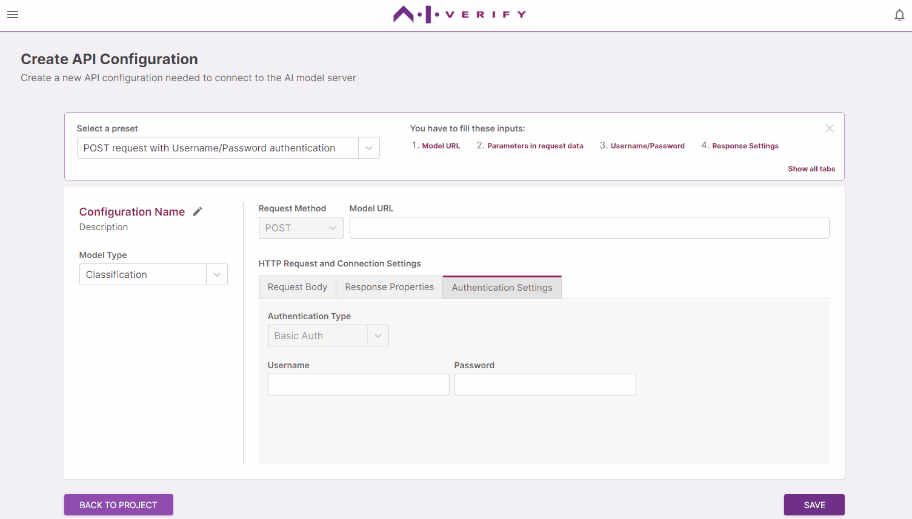
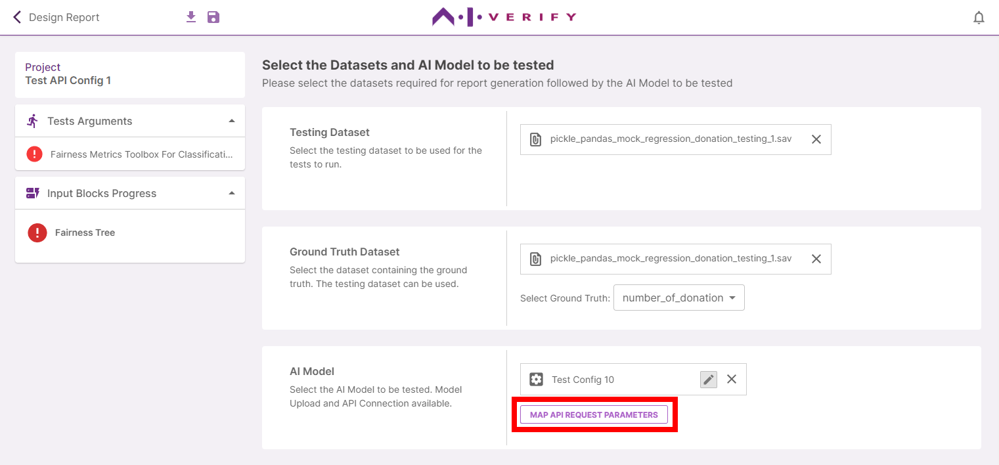
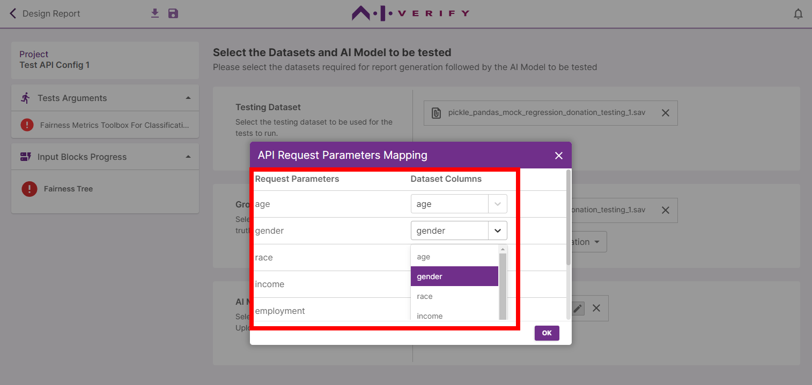

# Introduction

An AI Model API Configuration enables the toolkit to test a remote AI Model API. The remote API must be a HTTP API accessible via URL (e.g https://apiservername.com/predict/tc001).

### Create a New API Configuraton

In the [`How to Test an AI Model and Generate Report Tutorial`](../../using-toolkit-step-by-step/test-ai-model-and-generate-report/6-select-ai-model/), you can create a new API Configuration by choosing `Connect to AI Model API` at Step 6 and then clicking **Next**.

You can also land on the Create API Configuration screen if you clickthrough Models & Data to the New AI Model screen from the homepage (Homepage -> Models & Data -> New AI Model) and then choose `Connect to AI Model API`.

#### Describe the AI Model API (HTTP API)

The Create API Configuration screen displays a Configuration Designer which lets you describe the Model API and save it to a Configuration in the toolkit.

Click **'Need Help'** to get a list of presets.

Selecting a preset will narrow down the displayed tabs and enabled fields.

Hover your mouse pointer over the numbered guidelines to jump to the corresponding fields. Descriptions will be displayed on their tooltips.

Provide General Information in the left section.

| Field                 | Description                                                                             |
| --------------------- | --------------------------------------------------------------------------------------- |
| **Configuraton Name** | To identify this configuration when selecting a model in the report generation workflow |
| **Description**       | Description of the Model API                                                            |
| **Model Type**        | The type of Machine Learning Algorithm                                                  |

Provide API and Connection Information under the tabs in the right section. Also, add the properties or parameters that will be added to the request body or url.

| Field              | Description           |
| ------------------ | --------------------- |
| **Request Method** | HTTP Method           |
| **Model URL**      | URL of the remote API |

**Request Body**

| Field              | Description                                                                                                                                                                                |
| ------------------ | ------------------------------------------------------------------------------------------------------------------------------------------------------------------------------------------ |
| **Media Type**     | Format of HTTP request body data                                                                                                                                                           |
| **Batch Requests** | If enabled, multiple records of data from the dateset will be batched in every request instead of sending 1 record per request. Media Type will automatically be set to 'application/json' |
| **Batch Limit**    | Sets the size of a batch request (number of records). Defaults to -1 which means there is not limit                                                                                        |
| **Property Name**  | The identifier which a value from a record will be mapped to in the request body data (Mapping will done after selecting the dataset and model in the report generation flow )             |
| **Data Type**      | The data type of the corresponding property value                                                                                                                                          |

**URL Parameters**

| Field                  | Description                                                                                                                                                      |
| ---------------------- | ---------------------------------------------------------------------------------------------------------------------------------------------------------------- |
| **URL Parameter Type** | Query (query strings which is the part of a URL after a question mark) or Path (variable segments of URL)                                                        |
| **Parameter Name**     | The identifier which a value from a record will be mapped to in the URL (Mapping will done after selecting the dataset and model in the report generation flow ) |
| **Data Type**          | The data type of the corresponding parameter value                                                                                                               |

**Response Properties**

| Field                   | Description                                            |
| ----------------------- | ------------------------------------------------------ |
| **Success Status Code** | The HTTP Status code for success (200 by standard)     |
| **Media Type**          | Format of HTTP response body data                      |
| **Data Type**           | Describes the 'shape' of the data in the response body |

**Additional Request Headers**

| Field           | Description                                                   |
| --------------- | ------------------------------------------------------------- |
| **Header Name** | Name of the additional request header that the API might need |
| **Data Type**   | The data type of the header value                             |
| **Value**       | The value of the request header                               |

**Authentication Settings**

| Field                   | Description                                                                                                    |
| ----------------------- | -------------------------------------------------------------------------------------------------------------- |
| **Authentication Type** | If the API requires authentication, select the type here. Currently, Basic Auth and Bearer Token are supported |
| **Username**            | Username for Basic Auth type                                                                                   |
| **Password**            | Password for Basic Auth type                                                                                   |
| **Bearer Token**        | The security token string                                                                                      |

**Connection Settings**

| Field                  | Description                                                                                                                                                       |
| ---------------------- | ----------------------------------------------------------------------------------------------------------------------------------------------------------------- |
| **Connection Timeout** | The connection timeout when connecting to the server (in seconds). Defaults to -1 which means timeout is set to http's default timeout                            |
| **Connection Retries** | The number of retries for connecting to server                                                                                                                    |
| **Max Connections**    | The maximum number of concurrent connection(s) that can be made to the server. Defaults to -1 which means there is no maximum number or connections               |
| **Rate Limit**         | The maximum number of request(s) allowed to be made to the server per second. Defaults to -1, which means there is no limit                                       |
| **Rate Limit Timeout** | The connection timeout when connecting to the server(in seconds) when there is rate limiting. Defaults to -1 which means timeout is set to http's default timeout |

### Choose Existing API Configuration to test

In the [`How to Test an AI Model and Generate Report Tutorial`](../../using-toolkit-step-by-step/test-ai-model-and-generate-report/6-select-ai-model/), you can choose an existing Model API Configuration at Step 6 and click **Use Model**.

Click **'Map API Request Parameters'** to map Request Body Properties or URL Parameters to the columns in the dataset.

