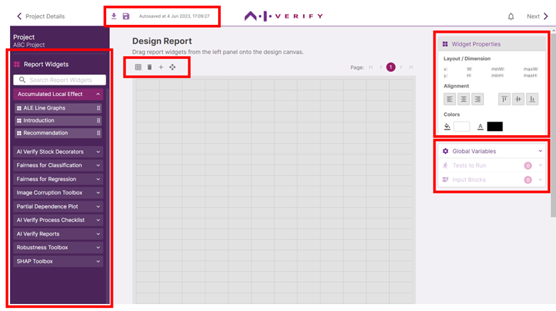

The canvas page is where you design your report using report widgets.

### **Report Widgets**

The report widgets panel on the left of the screen lists the report widgets installed in your toolkit. They are categorised into accordions, according to the plugin they belong to. Expand each accordion to view the list of widgets it contains and hover over the widget name to view its description. To add a widget to the canvas, simply drag and drop it onto the canvas.

[(See How to design a customized report > Step 3)](../../using-toolkit-step-by-step/design-customized-report/3-design-report-with-widgets/)

### **Canvas Actions**

Canvas actions allow you to design and create your own multi-paged report.

| Icon                                                                | Action                                                  |
| ------------------------------------------------------------------- | ------------------------------------------------------- |
|      | Toggle to view the grid lines the widgets will snap to. |
|  | Delete page                                             |
|          | Add new page                                            |
|        | Move page                                               |

### **Widget Properties**

To help you style your report, widget properties are design tools that allows you to configure the layout, alignment, and colours of widgets.

### **Global Variables **

Global Variables is a special functionality developed to help ease the process of designing a report from scratch. We understand that official reports usually come with many features that are consistent throughout its pages, such as headers, footnotes, and names of things. You can define these repeated values as Global Variables that you can use within some of the report widgets.

[(See How to design a customized report > Step 4)](../../using-toolkit-step-by-step/design-customized-report/4-using-global-variable/)

### **Tests to Run, Input Blocks**

Some report widgets come with dependencies on tests to run or additional user inputs (input blocks). As you include various widgets in your report, the Tests to Run and Input Blocks accordions help you to keep track of what you are currently adding to your test suite.
