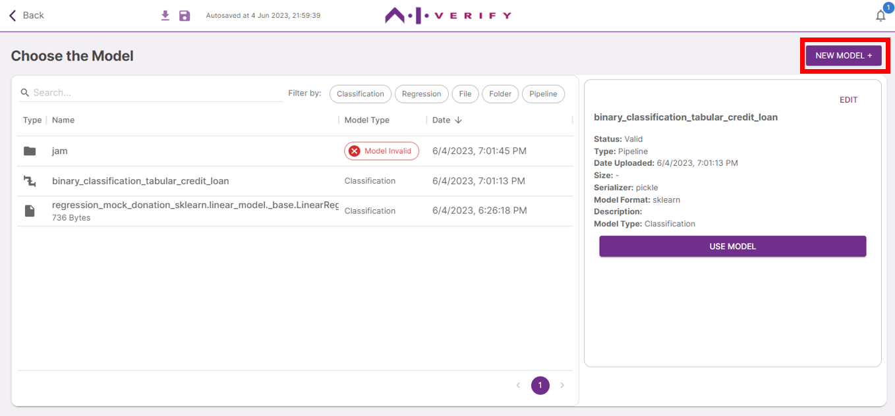
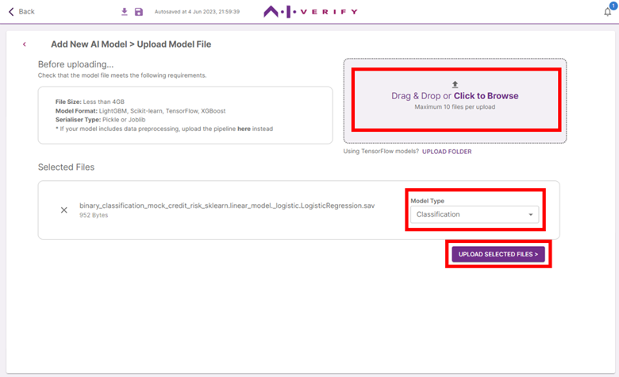
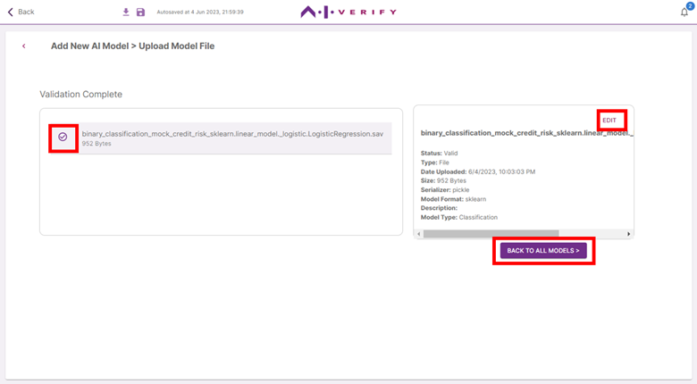
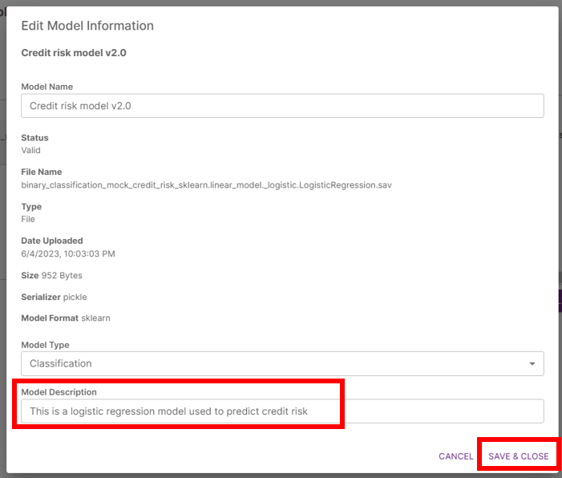

Click on **‘Choose Model’**. If you have previously uploaded the AI Model to be tested, click on the **row of the AI Model**. Note that AI Models marked ‘Invalid’ have invalid properties and cannot be used.

 Click on **‘Use Model’** and [Skip to Step 7](../7-provide-test-args)

To upload new AI Models, click on **‘New Model +’**.

Select the type of AI Model to upload (AI Model / Pipeline) and click **‘Next’**. For this tutorial, we will be uploading an AI Model.

Drag and drop the AI Model file(s) onto the drop box or click to select files. A maximum of 10 files can be uploaded at once. For TensorFlow models, click on **‘Upload Folder’** to select the folder to be uploaded. For more information on model preparation, [(See Getting Started > Preparation of Input Files).](../../getting-started/preparation-of-input-files.md)

Click on the **dropdown** beside each file picked to indicate its model type. In this tutorial, we will use *Classification*.

Click **‘Upload Selected Files >’**.

Once model validation is completed, you can view the model information on the right panel.

If the model is valid, you can edit the model name, description and model type by clicking on *‘Edit’*. You should describe the model's purpose as its description if you are using the AI Verify report templates.

If the model is invalid, refer to the error message for more information.

Click on **‘Back to all Models’**.

Select the AI Model to be tested by clicking on its row, then **‘Use Model’**.

